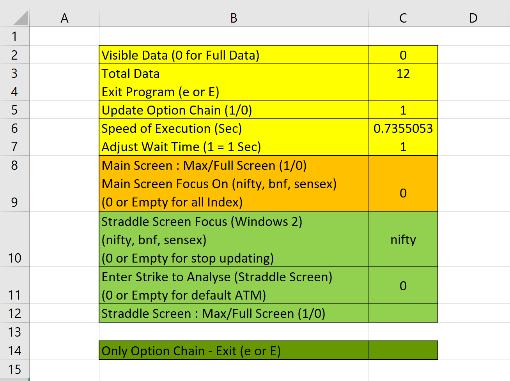

## 🧾 Excel Summary Tab – System Control Panel

The **Summary tab** in the Excel workbook acts as a **central control panel** for the entire system.  
It allows **real-time control, monitoring, and performance tuning** of data processing, visualization, and screen behavior — without stopping the program.

This design enables long-running, tick-by-tick analysis while maintaining responsiveness and usability.

---
## 🖼 Control Panel Preview

## 🟨 Data Visibility & Performance Controls

### 🔹 Visible Data (0 = Full Data)
Controls how many **recent data points** are plotted on the charts.

- As the trading session progresses, tick-by-tick data can grow into **thousands of points**
- Plotting all points can overcrowd graphs and impact performance
- This control allows plotting **only the most recent N data points**

**Example**
- Total accumulated points at 12:00 PM → ~4000
- Set `Visible Data = 1000`
- Only the **latest 1000 ticks** are displayed on plots

📌 Set to `0` to display **full data history**.

---

### 🔹 Total Data
- Displays the **current total number of tick records** accumulated
- Updates continuously as new ticks arrive
- Useful for:
  - Performance monitoring
  - Session progress tracking

---

## 🟥 System Execution Controls

### 🔹 Exit Program (`e` or `E`)
- Type `e` or `E` to **gracefully stop the system**
- Ensures:
  - Clean shutdown
  - No corrupted data
  - Safe termination of data streams and plots

---

### 🔹 Update Option Chain (1 / 0)
Controls whether the **option chain itself** should be updated.

- `1` → Option chain **updates normally**
- `0` → Option chain update **paused**

📌 When paused:
- Tick-by-tick **pyqtgraph windows continue updating**
- Useful when:
  - Focusing purely on sentiment / price behavior
  - Reducing API load
  - Debugging or performance analysis

---

## 🟦 Performance & Timing Controls

### 🔹 Speed of Execution (Seconds)
Displays the **time taken to process each update cycle**.

- Reflects system load as data accumulates
- Typical behavior:
  - Early session → ~0.2 seconds
  - Mid session → ~1–2 seconds
  - Late session → ~3+ seconds

📌 This increase is expected, as the system:
- Manages **15–20 strikes around ATM**
- Processes LTP, OI, volume, VWAP, OBV
- Continuously updates multiple pyqtgraph windows

This metric provides **real-time insight into computational load**.

---

### 🔹 Adjust Wait Time (1 = 1 Second)
Controls **how frequently data is processed and plotted**.

- Value represents seconds between updates
- Examples:
  - `1` → update every 1 second
  - `2` → update every 2 seconds
  - `3` → update every 3 seconds

📌 Allows balancing between:
- Plot smoothness
- CPU load
- Long-session stability

---

## 🟧 Window 1 (Main Screen) Controls

### 🔹 Main Screen: Max / Full Screen (1 / 0)
Controls **window state** for **Window 1 (Main Sentiment Dashboard)**.

- `1` → Maximize / Full screen
- `0` → Normal window mode

---

### 🔹 Main Screen Focus On (nifty / bnf / sensex / 0)
Selects which indices are shown in **Window 1**.

- `nifty` → Show only NIFTY column
- `bnf` → Show only BANKNIFTY column
- `sensex` → Show only SENSEX column
- `0` or empty → Show **all three indices**

📌 Useful when:
- Focusing on a single index
- Reducing visual clutter
- Monitoring one market during high volatility

---

## 🟩 Window 2 (Straddle Screen) Controls

### 🔹 Straddle Screen Focus (nifty / bnf / sensex)
Controls which index is analyzed in **Window 2 (Strike-Level Pressure Dashboard)**.

- Selects the index whose:
  - ATM straddle
  - OTM CE & PE strikes
  - LTP vs VWAP plots
  are visualized

📌 Enter `0` or leave empty to **pause updates** for Window 2.

---

### 🔹 Enter Strike to Analyse (Straddle Screen)
Controls the **ATM strike selection** for the **central 2 × 2 straddle plot**.

- `0` or empty → Automatic **live ATM**
- Any strike value → Manual ATM override

📌 Allows:
- Fixed-strike analysis
- Studying behavior of a specific level
- Comparing auto-ATM vs static strikes

---

### 🔹 Straddle Screen: Max / Full Screen (1 / 0)
Controls **window state** for **Window 2**.

- `1` → Maximize / Full screen
- `0` → Normal window mode

---

## 🧠 Design Philosophy Behind Summary Tab

- No need to restart the system
- Live tuning during market hours
- Separation of:
  - Data collection
  - Processing
  - Visualization
- Designed for **long-running intraday sessions**

The Summary tab turns the system into an **interactive research tool**, not just a passive dashboard.

---
