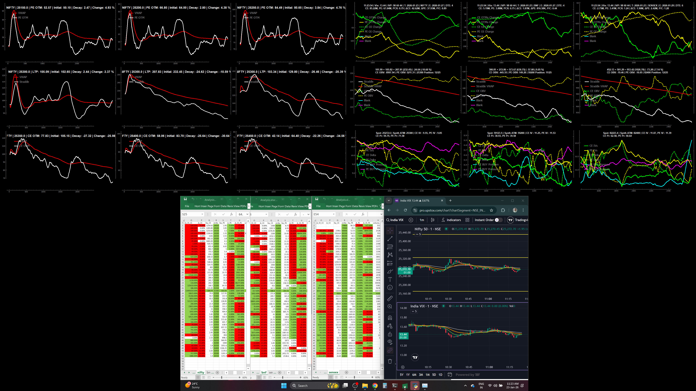

## 🖥 Live Visualization Layout

The system is organized into **three dedicated visualization windows**, each serving a distinct analytical purpose — from macro sentiment to microstructure pressure and cross-index comparison.

## 🖼 Sample Output

### Live Tick-by-Tick Sentiment Visualization

*(All plots update tick-by-tick in real time)*

---

## 🪟 Window 1 – Multi-Index Sentiment Dashboard (Macro View)

Window 1 provides a **high-level, option-chain–driven sentiment view** across all three indices simultaneously.

### Layout
- **3 × 3 grid of subplots**
- Columns represent indices:
  - Column 1 → **NIFTY**
  - Column 2 → **BANKNIFTY**
  - Column 3 → **SENSEX**
- Each column contains **3 vertically stacked subplots**

> The explanation below refers to **NIFTY (Column 1)**.  
> The same logic applies identically to BANKNIFTY and SENSEX.

---

### 📊 Subplot 1 (Row 1): OTM CE vs PE Pressure Analysis

**Purpose:**  
Detects **directional pressure and sentiment imbalance** using OTM options.

**Analysis Performed**
- Change in **LTP (CE vs PE)** for OTM strikes
- Change in **OI (CE vs PE)** for OTM strikes
- Pressure comparison between Call and Put sides

**Dynamic Logic**
- OTM strikes are selected dynamically
- As ATM shifts with market movement, OTM strikes update automatically

**Textual Context Displayed**
- Time, Date, Index
- Expiry, DTE
- India VIX
- IV Percentiles (6M / 1Y / 2Y)
- CE & PE OI build-up (vs previous day close)
- OI-based PCR
- Intraday CE & PE OI change (vs today’s open)
- Intraday PCR

---

### 📊 Subplot 2 (Row 2): Dynamic ATM Straddle Analysis

**Purpose:**  
Tracks **volatility expansion / decay** and institutional activity at the ATM.

**Analysis Performed**
- Live ATM straddle price
- Straddle VWAP
- OBV of ATM CE and ATM PE

**Textual Context Displayed**
- Straddle price at market open (09:15)
- Current straddle price
- Net decay / expansion
- ATM CE OBV
- ATM PE OBV
- Synthetic ATM strike

---

### 📊 Subplot 3 (Row 3): IV, Delta & Buying Pressure

**Purpose:**  
Measures **volatility behavior and order-flow pressure**.

**Analysis Performed**
- Average OTM IV (CE & PE)
- Delta changes (CE & PE)
- Buying pressure using bid–ask quantity imbalance

**Textual Context Displayed**
- Spot price
- Synthetic ATM
- CE & PE average OTM IV
- CE & PE buying pressure

---

## 🪟 Window 2 – Tick-by-Tick Strike-Level Pressure Dashboard (Micro View)

Window 2 is a **high-resolution, strike-specific microscope**, focused on **immediate price behavior vs VWAP**.

### Layout
- **3 × 3 grid**
- One index selected at a time:
  - NIFTY / BANKNIFTY / SENSEX
- Entire window updates for the selected index only

---

### 🎯 Central Focus: ATM Straddle (2 × 2 Block)

- Center **2 × 2 block** plots:
  - **ATM Straddle LTP vs VWAP**
- Represents the **core sentiment and volatility zone**
- ATM can be:
  - Auto-selected (current ATM)
  - Manually selected (user-defined)

---

### 📉 Put-Side Analysis (Left & Top)

- Immediate left of center:
  - ATM **PE LTP vs VWAP**
- Top row:
  - **OTM PE strikes below ATM**
  - LTP vs VWAP
- Coverage:
  - ATM PE + **up to 4 OTM PE strikes**

Captures **downside pressure buildup and defensive positioning**.

---

### 📈 Call-Side Analysis (Right & Bottom)

- Immediate right of center:
  - ATM **CE LTP vs VWAP**
- Bottom row:
  - **OTM CE strikes above ATM**
  - LTP vs VWAP
- Coverage:
  - ATM CE + **up to 4 OTM CE strikes**

Captures **upside aggression and call dominance**.

---

### 🧠 What Window 2 Reveals

- Tick-level price vs VWAP divergence
- Instant pressure buildup
- Early sentiment shifts
- Volatility expansion / contraction
- CE vs PE dominance around ATM

> Window 1 = **Macro sentiment scanner**  
> Window 2 = **Microstructure microscope**

---

## 🪟 Window 3 – Cross-Index Option Chain & Market Context Dashboard

Window 3 provides a **side-by-side comparative view** of **all three indices**, combined with **spot price and volatility context**.

---

### 📊 What Window 3 Displays

#### 🔹 Option Chain Comparison (All Indices)
- **NIFTY, BANKNIFTY, and SENSEX option chains** shown together
- For both **CE and PE sides**, strike-wise:
  - LTP
  - Change in LTP
  - Change in OI (reference: previous day close)

This enables **intraday analysis** of:
- Long build-up
- Short build-up
- Long unwinding
- Short covering

Across **all three indices simultaneously**.

---

#### 🔹 Spot & Volatility Context
- **NIFTY candlestick chart**
- **India VIX candlestick chart**
- Provides macro confirmation to option-chain behavior

---

### 🧠 What Window 3 Reveals

- Relative strength and weakness across indices
- Index-wise divergence or convergence
- Option-chain positioning vs actual price action
- Volatility confirmation using India VIX
- Broader market context for intraday decisions

---

